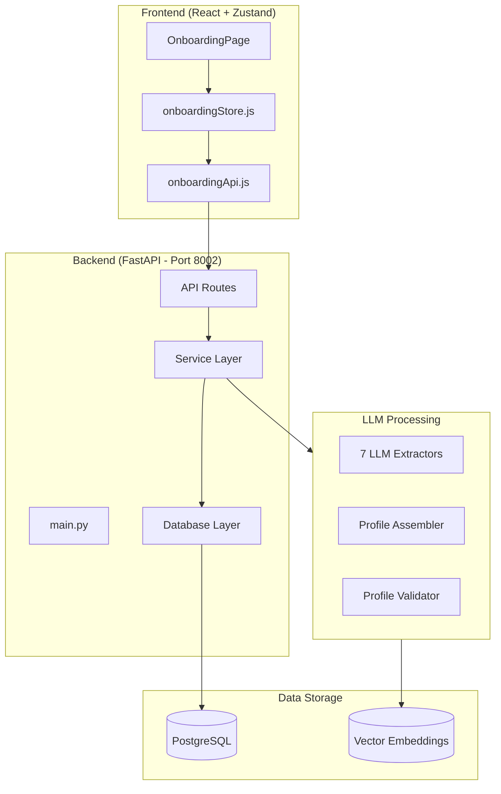
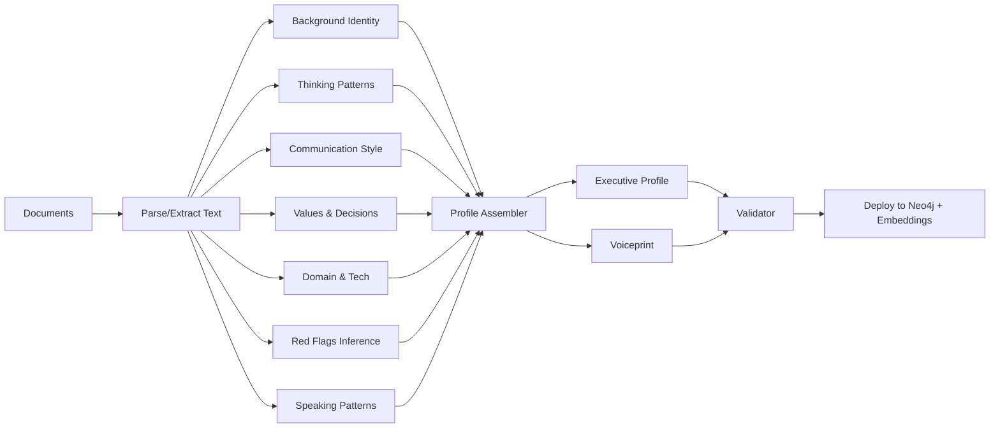

# Onboarding Service - Comprehensive Overview

Last 6 commits analyzed:
- `a9fe614` - Fix: Add missing model files
- `01f7c07` - frontend implementation with onboarding pipeline
- `d3f4274` - knowledge base separation with executive profile data
- `8f1a225` - config correction
- `40a9af0` - feat(onboarding): comprehensive migrations, OCR support & documentation

---

## Architecture Overview



---

## 1. Backend Structure

### Location: `RAG/onboarding/`

| Directory | Purpose |
|-----------|---------|
| `routes/` | FastAPI routers (4 modules) |
| `services/` | Business logic layer (4 modules) |
| `db/` | Database access layer (6 modules) |
| `extractors/` | 7 LLM extractors for profile generation |
| `parsers/` | Document parsing (PDF, DOCX, OCR) |
| `deployer/` | Profile deployment to Neo4j + embeddings |
| `assembler/` | Profile assembly from extractions |
| `validator/` | Profile validation |

---

## 2. API Endpoints

### Companies (`/api/onboarding/companies`)

| Method | Endpoint | Description |
|--------|----------|-------------|
| `GET` | `/companies` | List all companies |
| `POST` | `/companies` | Create company |
| `GET` | `/companies/{id}` | Get company with executives |
| `PATCH` | `/companies/{id}` | Update company |
| `GET` | `/companies/{id}/executives` | List executives (hierarchical) |

### Executives (`/api/onboarding/companies/{company_id}/executives`)

| Method | Endpoint | Description |
|--------|----------|-------------|
| `POST` | `/executives` | Create executive |
| `GET` | `/executives/{id}` | Get executive (with ?include=profile,voiceprint) |
| `PATCH` | `/executives/{id}` | Update executive |
| `DELETE` | `/executives/{id}` | Soft delete executive |

### Documents (`/api/onboarding/companies/{company_id}/executives/{exec_id}/documents`)

| Method | Endpoint | Description |
|--------|----------|-------------|
| `POST` | `/documents` | Upload profile documents (multipart) |
| `GET` | `/documents` | List documents |
| `GET` | `/documents/{id}` | Get document with extracted text |
| `DELETE` | `/documents/{id}` | Soft delete document |
| `POST` | `/documents/{id}/restore` | Restore document |

### Knowledgebase (`/api/onboarding/companies/{company_id}/knowledgebase`)

| Method | Endpoint | Description |
|--------|----------|-------------|
| `POST` | `/knowledgebase` | Upload company-wide docs (bypass LLM) |
| `GET` | `/knowledgebase` | List knowledgebase docs |
| `GET` | `/knowledgebase/{id}` | Get document |
| `DELETE` | `/knowledgebase/{id}` | Soft delete |

### Profile & Voiceprint

| Method | Endpoint | Description |
|--------|----------|-------------|
| `GET` | `/executives/{id}/profile` | Get profile + voiceprint + validation |
| `PATCH` | `/executives/{id}/profile` | Edit profile sections |
| `GET` | `/executives/{id}/voiceprint` | Get voiceprint |
| `PATCH` | `/executives/{id}/voiceprint` | Edit voiceprint |

### Calibration & Jobs

| Method | Endpoint | Description |
|--------|----------|-------------|
| `POST` | `/executives/{id}/calibrate` | Start calibration job |
| `POST` | `/executives/{id}/onboard` | Start onboarding pipeline |
| `GET` | `/executives/{id}/jobs/{job_id}` | Get job status |
| `GET` | `/executives/{id}/jobs/{job_id}/result` | Get job result |

---

## 3. Database Schema

### Core Tables

```sql
-- Companies (multi-tenant isolation)
companies (
    id VARCHAR(50) PRIMARY KEY,
    name VARCHAR(255) NOT NULL,
    industry VARCHAR(100),
    description TEXT,
    metadata JSONB
)

-- Executive Profiles (extended)
executive_profiles (
    id VARCHAR(50) PRIMARY KEY,
    company_id VARCHAR(50),        -- Added for multi-tenancy
    name VARCHAR(255) NOT NULL,
    name_english VARCHAR(255),     -- English name
    title VARCHAR(100),
    email VARCHAR(255),
    profile_data JSONB,            -- LLM-generated profile
    voiceprint_data JSONB,         -- LLM-generated voiceprint
    reports_to VARCHAR(50),        -- Org hierarchy
    hierarchy_level INTEGER,       -- 0=CEO, 1=C-suite, etc.
    sort_order INTEGER
)

-- Documents (profile vs knowledgebase)
executive_documents (
    id UUID PRIMARY KEY,
    company_id VARCHAR(50) NOT NULL,
    executive_id VARCHAR(50),      -- NULL for knowledgebase docs
    doc_type VARCHAR(20),          -- 'profile' or 'knowledgebase'
    filename VARCHAR(255),
    extracted_text TEXT,
    parsing_method VARCHAR(30),
    ocr_applied BOOLEAN
)

-- Onboarding Jobs (async processing)
onboarding_jobs (
    id UUID PRIMARY KEY,
    company_id VARCHAR(50),
    executive_id VARCHAR(50),
    job_type VARCHAR(50),          -- full_onboarding, calibration
    status VARCHAR(30),            -- pending, parsing, extracting, completed
    progress REAL,
    assembled_profile JSONB,
    assembled_voiceprint JSONB,
    validation_report JSONB,
    calibration_mode VARCHAR(30),
    extractors_run JSONB
)

-- Embeddings (extended)
embeddings (
    company_id VARCHAR(50),        -- Added
    executive_id VARCHAR(50),      -- Added (NULL for knowledgebase)
    metadata JSONB                 -- Added
)
```

### Key Database Migrations

| File | Purpose |
|------|---------|
| `onboarding_migration.sql` | Core tables + multi-tenant columns |
| `phase9_multitenant_migration.sql` | Multi-tenant extensions |
| `phase10_ocr_metadata_migration.sql` | OCR support columns |
| `phase11_knowledgebase_migration.sql` | Profile vs KB document separation |

---

## 4. LLM Extractors Pipeline

The calibration service runs 7 specialized extractors on uploaded documents:



### Extractor Details

| Extractor | Output |
|-----------|--------|
| `background_identity.py` | Education, career, expertise |
| `thinking_patterns.py` | Decision-making style, cognitive patterns |
| `communication_style.py` | Formality, tone, preferred channels |
| `values_decisions.py` | Core values, priorities, philosophy |
| `domain_tech.py` | Technical expertise, domain knowledge |
| `red_flags_inference.py` | Always-do/never-approve rules |
| `speaking_patterns.py` | Voiceprint, phrases, style markers |

---

## 5. Frontend Implementation

### Components (`frontend/src/components/onboarding/`)

| Component | Purpose |
|-----------|---------|
| `FileUploader.jsx` | Drag-drop file upload |
| `DocumentRow.jsx` | Document list item with delete |
| `ExecutiveRow.jsx` | Executive list with hierarchy indent |
| `CompanyCard.jsx` | Company card for list view |
| `StatusBadge.jsx` | Status indicators |
| `CalibrationProgress.jsx` | Job progress display |

### Pages (`frontend/src/pages/admin/`)

| Page/View | Route | Purpose |
|-----------|-------|---------|
| `OnboardingPage.jsx` | `/admin/onboarding` | Main container |
| `CompanyListView.jsx` | `/admin/onboarding` | List all companies |
| `CompanyDetailView.jsx` | `/admin/onboarding/companies/:id` | Company + executives + knowledgebase |
| `ExecutiveDetailView.jsx` | `/admin/onboarding/companies/:id/executives/:execId` | Profile + docs + calibration |

### State Management (`onboardingStore.js`)

Zustand store with:
- **Optimistic updates** for responsive UI
- **Job polling** for calibration progress
- **Selective subscriptions** for performance

Key state:
```javascript
{
  companies: [],
  selectedCompany: null,
  executives: [],
  selectedExecutive: null,
  profileDocuments: [],
  knowledgebaseDocuments: [],
  activeJob: null,
}
```

---

## 6. Processing Flow

### Full Onboarding Pipeline

```
1. Create Company → POST /companies
2. Create Executive → POST /companies/{id}/executives
3. Upload Documents → POST /executives/{id}/documents
4. Start Calibration → POST /executives/{id}/calibrate
   ├── Parsing (PDF/DOCX/TXT → text)
   ├── Extracting (7 LLM extractors in parallel)
   ├── Assembling (merge extractions)
   ├── Validating (consistency check)
   ├── Deploying (Neo4j + embeddings)
   └── Complete
5. View Profile → GET /executives/{id}/profile
```

### Document Types

| Type | Path | Processing |
|------|------|------------|
| **Profile** | `executive_id` is set | Full LLM extraction → Profile + Voiceprint |
| **Knowledgebase** | `executive_id = NULL` | Parse → Chunk → Embed directly |

---

## 7. Current Status

### ✅ Completed Features

- Multi-tenant company/executive management
- Document upload with PDF/DOCX/TXT/JSON parsing
- OCR support for scanned documents
- 7-extractor LLM pipeline for profile generation
- Knowledgebase document separation
- Profile/voiceprint editing
- Full/incremental calibration modes
- Frontend admin dashboard with 3-level navigation
- Zustand state management with optimistic updates
- Job status polling and progress display

### 🔧 Architecture Decisions

1. **Multi-tenant isolation**: All resources scoped by `company_id`
2. **Document separation**: Profile docs (LLM extraction) vs Knowledgebase (direct embedding)
3. **Async jobs**: Long-running calibration via background tasks
4. **Soft deletes**: Documents marked inactive, not removed
5. **Hierarchy support**: `reports_to` and `hierarchy_level` for org charts

---

## 8. Key Files Reference

### Backend
| File | Lines | Purpose |
|------|-------|---------|
| [main.py](file:///home/jupyter/FirstWeek/RAG/onboarding/main.py) | 762 | FastAPI app with main routes |
| [models.py](file:///home/jupyter/FirstWeek/RAG/onboarding/models.py) | 431 | Pydantic schemas |
| [calibration_service.py](file:///home/jupyter/FirstWeek/RAG/onboarding/services/calibration_service.py) | 367 | Calibration orchestration |
| [document_service.py](file:///home/jupyter/FirstWeek/RAG/onboarding/services/document_service.py) | ~250 | Document upload/parse |
| [knowledgebase_service.py](file:///home/jupyter/FirstWeek/RAG/onboarding/services/knowledgebase_service.py) | ~300 | KB document handling |

### Frontend
| File | Lines | Purpose |
|------|-------|---------|
| [onboardingApi.js](file:///home/jupyter/FirstWeek/frontend/src/services/onboardingApi.js) | 398 | API client |
| [onboardingStore.js](file:///home/jupyter/FirstWeek/frontend/src/store/onboardingStore.js) | 604 | Zustand store |
| [OnboardingPage.jsx](file:///home/jupyter/FirstWeek/frontend/src/pages/admin/OnboardingPage.jsx) | 143 | Main page |
| [CompanyDetailView.jsx](file:///home/jupyter/FirstWeek/frontend/src/pages/admin/views/CompanyDetailView.jsx) | 400 | Company view |
| [ExecutiveDetailView.jsx](file:///home/jupyter/FirstWeek/frontend/src/pages/admin/views/ExecutiveDetailView.jsx) | 648 | Executive view |

### Migrations
| File | Purpose |
|------|---------|
| [onboarding_migration.sql](file:///home/jupyter/FirstWeek/RAG/config/onboarding_migration.sql) | Core schema |
| [phase11_knowledgebase_migration.sql](file:///home/jupyter/FirstWeek/RAG/config/phase11_knowledgebase_migration.sql) | KB separation |
