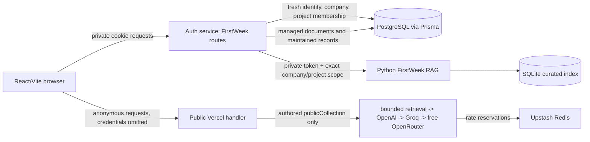
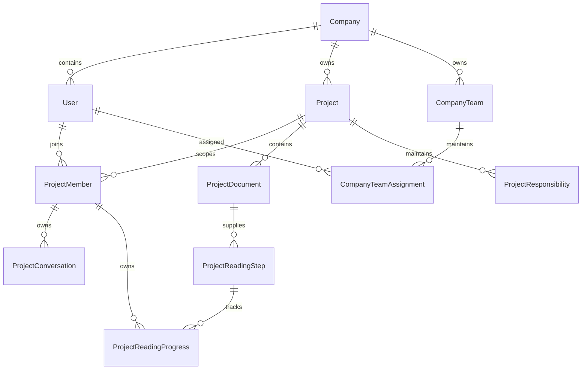

# FirstWeek project map for reviews

Purpose: give reviewers the current system shape before they inspect a scoped diff. This is a routing map, not a replacement for reading code touched by a change.

## Current product state

- M1 and M2-01/M2-02/M2-03 are accepted locally. Gauss accepted M2-03 at 100/100 on 2026-09-16; M2-04 overall integration/acceptance remains next. See `TRACK.md` for the live acceptance record and `MILESTONES.md` for scope.
- Private workspace: authenticated, company and project membership scoped, with curated and managed knowledge, maintained context, saved conversations and onboarding preferences.
- Public showcase: separate six-project collection and anonymous read-only API. Movie Enquirer is published with completed status. The collection must never import the private manifest, database, project documents, company teams, profiles, or saved conversations.
- Private corpus: five curated projects and 46 indexed sections after the M2-03 guide refresh (2026-09-16). Public deployment is not yet accepted.

## System graph

## Ownership map

| Changed area | Start here | Follow into | Main review risk |
| --- | --- | --- | --- |
| Private routes/auth | `backend/auth-service/routes/firstweekRoutes.js` | `services/*.js`, `shared/prisma/schema.prisma`, route tests | Browser body must not choose identity/company/project scope; recheck current membership after external RAG work. |
| Project/member administration | `services/projectAdministration.js` | `Project`, `ProjectMember`; `projectAdministration` integration tests | Company admin is not source access. MAINTAINER actions require exact current project membership. |
| Responsibilities | `services/projectResponsibilities.js` | `ProjectResponsibility`; RAG maintained payload | No inferred owner; assigned user must be in the same project. |
| Managed documents | `services/projectDocuments.js` | `ProjectDocument`, chunks; RAG `managedSources` | Bounded type/size/text, source scope, version/invalidation and deletion cascades. |
| Conversations/Ask | `routes/conversationRoutes.js`, `services/projectConversations.js` | `firstweekRoutes.js` forwarding, `RAG/firstweek/api.py` | Server-owned bounded history, idempotency, current membership/knowledge freshness after generation. |
| Profiles | `services/onboardingProfiles.js`, `src/firstweek/OnboardingProfile.jsx` | `ProjectMember.profileVersion`, RAG profile guidance | Self-only preferences change answer style only, never role/access/ownership. |
| Reading paths | `services/readingPaths.js`, `src/firstweek/ReadingPath.jsx` | `ProjectReadingStep`, `ProjectReadingProgress`, reading-path routes/tests, managed-document deletion | Exact managed-source scope, fresh maintainer authority, project-locked ordering/quota, revision-fenced self-only progress and profile-matching counts. |
| Company teams | `services/companyTeams.js`, `services/companyContext.js`, `src/firstweek/CompanyTeams.jsx` | `CompanyTeam`, assignments, RAG `companySources` | Current `COMPANY_ADMIN` writes; company evidence is not project access or responsibility proof. |
| Private workspace UI | `frontend/src/firstweek/Workspace.jsx`, `api.js` | `ProjectAdministration.jsx`, source/architecture components, UI tests | Preserve public/private capability split and mobile/error states. |
| Public showcase | `frontend/src/firstweek/PublicApp.jsx`, `publicApi.js` | `frontend/server/publicHandler.js`, `publicChat.js`, `publicCollection.js`, `vercel.json` | Separate public-only data, exact origin/JSON checks, no cookies/private requests, Redis limits fail closed. |
| Curated knowledge/RAG | `knowledge/firstweek/manifest.json`, `firstweek.md` | `RAG/firstweek/index.py`, `api.py`, `test_api.py`, `test_index.py` | Evidence hashes must match; service token/private network required; citations only support current scoped evidence. |

## Data and authorization graph

## Required review path

1. Read this map, `TRACK.md`, the relevant M2 plan or milestone entry, then the actual diff.
2. Trace only the changed row in the ownership map, its adjacent schema/model and its focused tests. Expand beyond it only when an import, route or data flow crosses a trust boundary.
3. Report checks run separately from checks inspected. Score only the submitted scope using Gauss's rubric.
4. Treat generated/public code as a distinct security boundary. Never accept a change based only on client-side hiding of private controls.

## Git handoff

User-selected workflow: GPT-5.6-Sol implements and debugs; the primary assistant coordinates, reviews and owns TRACK.md; Gauss independently reviews and scores. No commit, push or deployment is implied by milestone acceptance. Publication requires separate explicit user direction naming the reviewed change and target; main must remain unchanged. No force push, history rewrite, credential output or unrelated-file publication.
